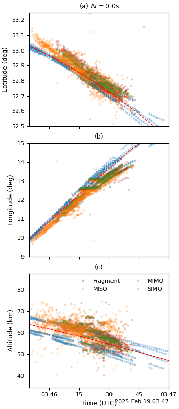

# Falcon 9 Re-entry Analysis

Analysis workspace for the 19 February 2025 Falcon 9 upper-stage re-entry over central Europe.

This repository contains the optical, radar, and trajectory-analysis code used to study the event, including:

- AllSky7 optical fragment triangulation and calibration products
- SIMONe VHF radar matched-filter, Doppler, and RCS analysis
- Ballistic fitting and forward propagation of fragment trajectories
- Figure-generation scripts used for the manuscript analysis

The repository is a working research codebase rather than a small polished software package. Large intermediate files, derived figures, and diagnostic products are intentionally kept here because they are part of the analysis record.

## Getting Started

The most practical way to start is:

1. Clone the repository.
2. Download the curated event data from Zenodo.
3. Place the released files in the repository layout expected by the scripts.
4. Start with the plotting and inspection scripts before rerunning heavier fitting or radar-processing steps.

Typical first steps:

```bash
git clone https://github.com/jvierine/falcon9.git
cd falcon9
python plot_all_figures.py
```

If you are working from the released data package rather than the full local analysis tree, see the Zenodo notes in [zenodo/README.md](zenodo/README.md) and the archive list in [zenodo_archives/MANIFEST.md](zenodo_archives/MANIFEST.md).

## Example Outputs

Representative outputs already included in the repository:





Additional publication-style products in this repository include:

- [fig_map_falcon9.pdf](fig_map_falcon9.pdf)
- [optical_radar_2x2.pdf](optical_radar_2x2.pdf)
- [snr_all_links_fullpage.pdf](snr_all_links_fullpage.pdf)
- [rcs_doppler_triptych.pdf](rcs_doppler_triptych.pdf)
- [hgt_hist.pdf](hgt_hist.pdf)
- [specific_energy_loss_rate_publication.pdf](specific_energy_loss_rate_publication.pdf)

## Main Workflow

The main script families are:

- `triangulate.py`: triangulate fragment positions from paired optical observations.
- `fragment_fit.py`: prepare fragment-track products for later fitting.
- `fit_ballistic.py`, `fit_ballistic2.py`, `fit_ballistic3.py`: ballistic fitting workflows for individual and shared-start trajectory fits.
- `run_sharedstart_mcmc.py`: MCMC uncertainty analysis for shared-start ballistic fits.
- `range_doppler_mf.py`: matched filtering of SIMONe radar data.
- `plot_radar_modes.py`: summarize radar geometry, timing offsets, and detection modes.
- `plot_rcs_doppler_triptych.py`: generate combined RCS and Doppler publication figures.
- `plot_optical_radar.py` and `plot_optical_radar_2x2.py`: compare optical fragment trajectories with radar detections.
- `plot_fragments.py`: fragment-track and map visualizations.
- `plot_all_figures.py`: convenience entry point for regenerating several manuscript figures in one run.

## Reproducing Figures

For the current publication figures, the quickest starting points are:

```bash
python plot_all_figures.py
python plot_rcs_doppler_triptych.py
python plot_fragment_radar_height_hist_2col.py --output fragment_radar_height_hist_3col_mod.pdf
```

Some radar-processing scripts assume the `py-simone` conda environment and the local SIMONe decoding toolchain used during the analysis.

## Displaying Fragment Positions

The fragment position products are stored as HDF5 files under `fragments/`. A quick way to visualize the optical fragment geometry is to use the existing plotting code:

```bash
python -c "import plot_fragments as pf; pf.plot_map()"
```

This writes:

- `fig_map_falcon9.pdf`

To inspect the fragment-track arrays directly in Python:

```python
import plot_fragments as pf

hgt_count, hgt_count_all, fragment_ids, fragment_pos, fragment_pos_err, fragment_geo_pos, fragment_times = pf.get_fragments()

print(fragment_ids[:5])
print(fragment_geo_pos[0][:3])   # latitude, longitude, altitude_m
print(fragment_times[0][:3])     # unix seconds
```

The helper `plot_fragments.get_fragments()` is the main entry point used throughout the repository for loading the triangulated optical fragment positions.

## Reading Ballistic Fits

The shared-start ballistic fits are stored as HDF5 files such as:

- `ballistic_fit_sharedstart_1.h5`
- `ballistic_fit_sharedstart_2.h5`
- `ballistic_fit_sharedstart_k_a_7_2.h5`

The simplest way to inspect them programmatically is with `h5py`:

```python
import h5py
import numpy as np

with h5py.File("ballistic_fit_sharedstart_1.h5", "r") as h5:
    print(list(h5.keys()))
    print(h5["times_unix"][:3])
    print(h5["pos_ecef"][:3])
    print(h5["model/times_model"][:3])
    print(h5["model/lon_deg"][:3])
    print(h5["model/hgt_m"][:3] / 1e3)
    print(h5["impact/impact_lat_deg"][()])
    print(h5["impact/impact_lon_deg"][()])
```

Important groups and fields commonly used in this repository:

- top-level observed data:
  - `times_unix`
  - `pos_ecef`
  - `pos_ecef_err`
- fitted trajectory:
  - `model/times_model`
  - `model/lat_deg`
  - `model/lon_deg`
  - `model/hgt_m`
  - `model/relative_speed_m_s`
  - `model/specific_energy_loss_rate_w_kg`
- extrapolated impact products:
  - `impact/impact_lat_deg`
  - `impact/impact_lon_deg`
  - `impact/trajectory/...`

For map-style summaries of the fitted impact locations and trajectories, see:

```bash
python plot_ballistic_fit.py
```

## Repository Layout

- `fragments/`: triangulated optical fragment positions and fragment-track products
- `fits/`: ballistic-fit outputs and related diagnostics
- `radar/`: geodetic radar detection products and helper data
- `simone/`: SIMONe processing workspace, decoded products, and imaging outputs
- `plots/`: per-fragment and per-fit diagnostic plots
- `figures_radar/`: radar summary plots for different timing-offset assumptions
- `zenodo/`: staged Zenodo release content and figure-sidecar exports
- `zenodo_archives/`: archive manifests and tarballs prepared for data release

## Data

The curated data release for this project is archived on Zenodo:

- DOI: [10.5281/zenodo.20070800](https://doi.org/10.5281/zenodo.20070800)

If you want the released data rather than this full working repository:

1. Download the relevant archives from the Zenodo record above.
2. Use [zenodo/README.md](zenodo/README.md) for a directory-by-directory description of the released data products.
3. Use [zenodo_archives/MANIFEST.md](zenodo_archives/MANIFEST.md) to see the prepared archive names and sizes.
4. Use the public analysis code in this repository: [github.com/jvierine/falcon9](https://github.com/jvierine/falcon9).

The Zenodo bundle includes:

- compact geodetic radar detections
- triangulated optical fragment positions
- shared-start ballistic-fit outputs
- compact figure sidecar data for manuscript reproduction
- staged optical-camera videos and calibration products
- selected SIMONe decoded radar products

The public analysis code associated with the release is available here:

- [github.com/jvierine/falcon9](https://github.com/jvierine/falcon9)

## Data Acknowledgements

- Optical video data were provided by the [AllSky7 network](https://www.allsky7.net/).
- Radar data were provided by the Leibniz Institute of Atmospheric Physics at the University of Rostock (IAP) through the SIMONe radar measurements used in this study.

## Notes

- This repository includes many large intermediate files and is not intended to be a minimal install footprint.
- Several scripts expect local data files to be present in the repository root or under the existing analysis subdirectories.
- If you are starting from scratch, the most practical route is usually to obtain the curated Zenodo data products first and then run the plotting or fitting scripts you need.
