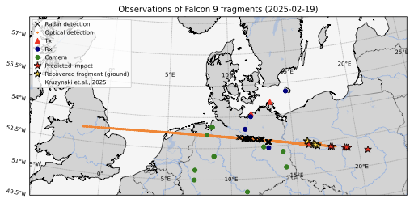
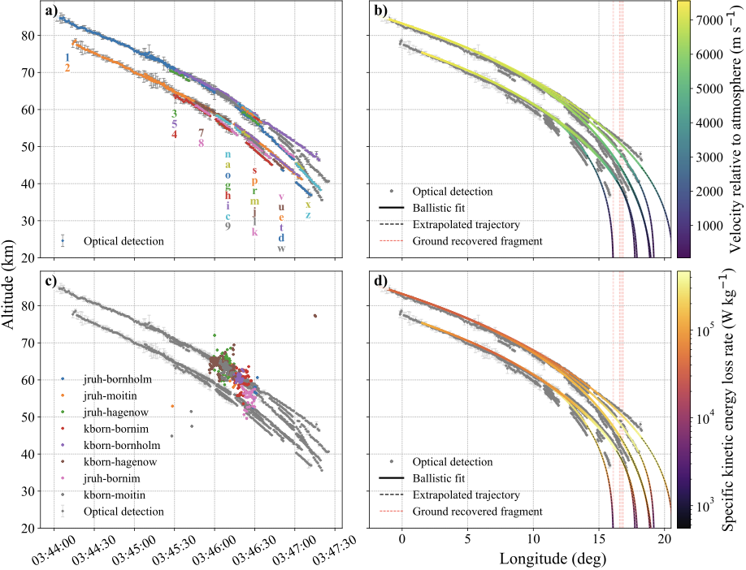

# Falcon 9 Re-entry Analysis

This repository contains the analysis code and working products used to study the 19 February 2025 Falcon 9 upper-stage re-entry over central Europe.

The project combines:

- optical fragment observations from the AllSky7 meteor camera network
- VHF radar observations from the SIMONe Germany multistatic radar system
- ballistic trajectory fitting and forward propagation
- figure generation for the associated manuscript

This is a research workspace rather than a minimal software package. It contains code, intermediate products, diagnostic outputs, and publication figures from the analysis.

## Article

The submitted article is available on arXiv:

- [arXiv:2605.29124v1](https://arxiv.org/abs/2605.29124v1)

## Example Figures

Representative figures from the paper:





Additional publication products in this repository include:

- [fig_map_falcon9.pdf](fig_map_falcon9.pdf)
- [optical_radar_2x2.pdf](optical_radar_2x2.pdf)
- [snr_all_links_fullpage.pdf](snr_all_links_fullpage.pdf)
- [rcs_doppler_triptych.pdf](rcs_doppler_triptych.pdf)
- [hgt_hist.pdf](hgt_hist.pdf)

## Data

The curated data release for this project is archived on Zenodo:

- DOI: [10.5281/zenodo.20070800](https://doi.org/10.5281/zenodo.20070800)

The public analysis repository is:

- [github.com/jvierine/falcon9](https://github.com/jvierine/falcon9)

If you want the released data rather than this full working repository:

1. Download the relevant archives from the Zenodo record.
2. Use [zenodo/README.md](zenodo/README.md) for a description of the released data products.
3. Use [zenodo_archives/MANIFEST.md](zenodo_archives/MANIFEST.md) for the prepared archive names and sizes.

The Zenodo release includes:

- compact geodetic radar detections
- triangulated optical fragment positions
- shared-start ballistic-fit outputs
- compact figure sidecar data for manuscript reproduction
- selected optical videos and calibration products
- selected decoded SIMONe radar products

## Fragment Position Format

Triangulated optical fragment positions are stored as HDF5 files under `fragments/`.

These files are loaded throughout the repository with `plot_fragments.get_fragments()`. The main information represented in the fragment products is:

- fragment identifier
- observation time
- estimated ECEF position
- estimated position uncertainty
- geodetic latitude, longitude, and altitude

The quickest visualization entry point is:

```bash
python -c "import plot_fragments as pf; pf.plot_map()"
```

## Ballistic-Fit Format

Ballistic-fit results are stored as HDF5 files such as:

- `ballistic_fit_sharedstart_1.h5`
- `ballistic_fit_sharedstart_2.h5`
- `ballistic_fit_sharedstart_k_a_7_2.h5`

These files contain three main kinds of information:

- observed trajectory samples used for fitting
- model trajectory outputs along the fitted path
- extrapolated impact-location products and associated uncertainty information

Common fields include:

- observed data:
  - `times_unix`
  - `pos_ecef`
  - `pos_ecef_err`
- model trajectory:
  - `model/times_model`
  - `model/lat_deg`
  - `model/lon_deg`
  - `model/hgt_m`
  - `model/relative_speed_m_s`
  - `model/specific_energy_loss_rate_w_kg`
- impact products:
  - `impact/impact_lat_deg`
  - `impact/impact_lon_deg`
  - `impact/trajectory/...`

## Data Acknowledgements

- Optical video data were provided by the [AllSky7 network](https://www.allsky7.net/).
- Radar data were provided by the Leibniz Institute of Atmospheric Physics at the University of Rostock (IAP) through the SIMONe radar measurements used in this study.
